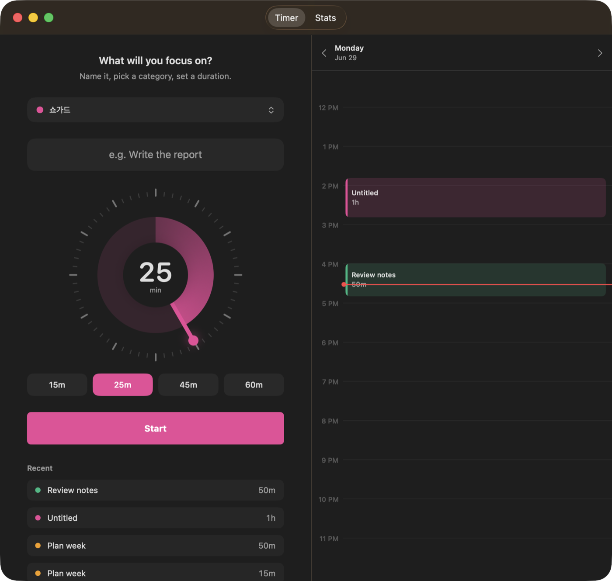
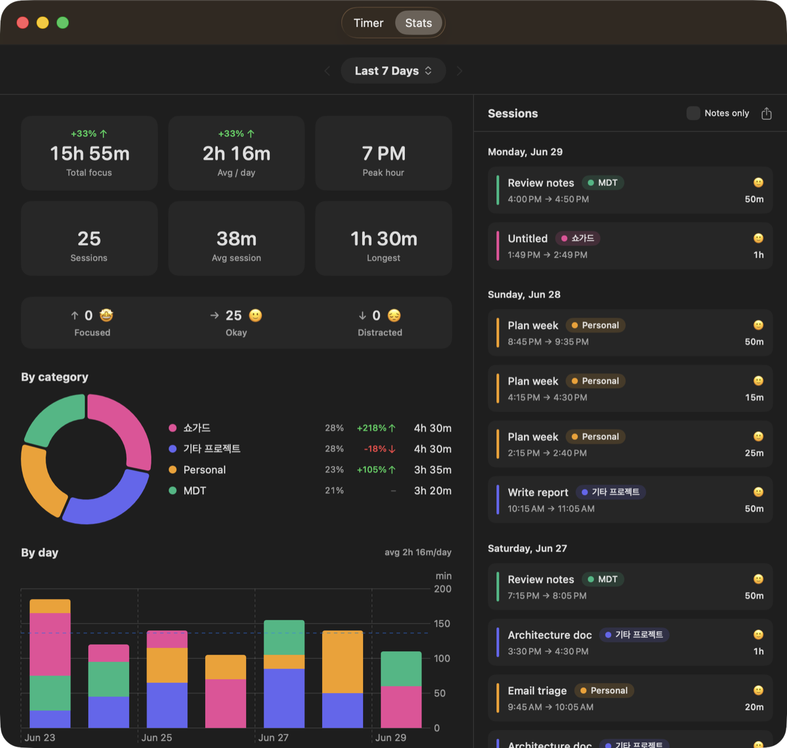

# FocusSession

집중 세션을 시작하고, 카운트다운을 보고, 끝나면 작업별로 시간을 쌓아 통계로 돌아보는 macOS 네이티브 타이머 앱.

> ⭐ 마음에 드셨다면 오른쪽 위 **Star**를 눌러주세요. 어떤 분들이 관심 있는지 알 수 있는 유일한 신호이고, 앞으로 개선하는 데 큰 힘이 됩니다.





## 기능

- ⏱ **원형 다이얼 타이머** — 시계 분침처럼 돌려 시간 설정 (5분 미만 ~ 60분 초과 자유롭게)
- 🎯 **세션 진행** — 카운트다운/경과 전환, 메뉴바 실시간 타이머, 일시정지/재개, 시작 시간 보정, 종료 시 만족도·메모 기록
- 🪟 **미니 위젯** — 진행 중 창을 접으면 반투명 타이머가 모든 창 위에 떠 있음 (정사각형·가로바 두 모양, 남은/경과 전환)
- 🔎 **작업명 자동완성** — 입력 시 기존 작업이 드롭다운으로 뜨고, 선택하면 연결된 프로젝트(카테고리)까지 자동 배정
- 🗂 **카테고리** — 색상 지정, 이름 변경, 드래그로 순서 변경, 아카이브
- 📊 **통계 대시보드** — 기간 전환(오늘/주/월/직접지정), 카테고리 도넛·일별 막대·작업 랭킹, CSV 내보내기
- 🟩 **연간 집중 캘린더** — GitHub 잔디 스타일로 1년간 집중한 날을 한눈에, 연도 이동·연간 통계
- 🗓 **타임테이블 패널** — 지난 세션을 시간표처럼 표시, 드래그·클릭으로 세션 추가, 블록 이동/편집, `now` 버튼, 집중과 별개인 **일정 블록**도 등록 가능
- 👥 **커뮤니티** — 지금 함께 집중 중인 사람들을 레이더로 보고, 주간 집중 시간·연속 기록(스트릭) 순위 확인 (익명 · 옵트인)
- 🔔 알림음 · 다크 모노크롬 UI

## 설치

> ⚠️ 이 앱은 Apple Developer 서명을 받지 않은 무료 배포본입니다. macOS Gatekeeper가 첫 실행을 막으므로 **처음 한 번만** 아래 방법으로 열어주세요.

1. [Releases](../../releases/latest)에서 `FocusSession-x.x.dmg`를 다운로드
2. dmg를 열고 **FocusSession**을 **Applications** 폴더로 드래그
3. 응용 프로그램에서 FocusSession을 **우클릭 → 열기** → 경고창에서 다시 **열기**
   - 한 번만 이렇게 열면 다음부터는 더블클릭으로 실행됩니다.

터미널이 편하면 격리 속성을 직접 제거해도 됩니다:

```bash
xattr -dr com.apple.quarantine /Applications/FocusSession.app
```

### 업데이트
새 버전이 나오면 [Releases](../../releases/latest)에서 최신 `dmg`를 받아 같은 방식으로 **Applications 폴더에 덮어쓰기** 하면 됩니다. 기존 세션 데이터와 설정은 그대로 유지됩니다. (서명되지 않은 새 빌드는 첫 실행 시 위의 **우클릭 → 열기** 또는 `xattr` 절차가 한 번 더 필요할 수 있습니다.)

### 요구 사항
- macOS 15 (Sequoia) 이상
- Apple Silicon · Intel 모두 지원 (유니버설 바이너리)

## 소스에서 빌드

[XcodeGen](https://github.com/yonaskolb/XcodeGen)이 필요합니다 (`brew install xcodegen`).

```bash
# 빌드 후 /Applications 에 설치하고 실행
./install.sh

# 배포용 .dmg 만들기 (dist/ 에 생성)
./package.sh 1.0
```

프로젝트 파일(`FocusSession.xcodeproj`)은 `project.yml`에서 생성되므로 저장소에 포함되지 않습니다. Xcode로 직접 열려면 `xcodegen generate` 후 `.xcodeproj`를 여세요.

## 기술 스택
SwiftUI · SwiftData · Swift Charts · Swift 6 (strict concurrency) · XcodeGen

## 개발 로그

### 2026-07 — 몰입 도구 확장
- **미니 위젯**: 진행 화면에서 접으면 반투명(90%) 플로팅 타이머가 모든 스페이스·전체화면 위에 표시. 카테고리 색 진행 링, 남은/경과 모드에 따라 채움↔비움, 정사각형·가로바 두 모양 전환(우상단 고정 리사이즈).
- **남은/경과 모드 통합**: 메인 진행 링과 미니 위젯이 같은 설정을 공유 — 링 탭 또는 ⟷ 버튼으로 남은 시간 카운트다운 ↔ 경과 시간 카운트업 전환.
- **시작 시간 보정**: 진행 화면에서 시작 시각을 직접 수정(일시정지 시간은 그대로 제외).
- **작업명·일정 자동완성**: 포커스 시작 화면과 타임테이블 편집기에서 기존 작업/일정이 드롭다운으로. 우측 프로젝트 색상 칩 표시, 선택 시 카테고리 자동 배정.

### 2026-07 — 통계 & 타임테이블
- **연간 집중 캘린더**: GitHub 잔디 스타일 기여 그래프. 폭에 맞춰 셀 자동 크기 조정(가로 스크롤 없음), 칸 호버로 그날 집중 시간, 연도 이동(‹ 2025 ›), 미래는 아웃라인, 연간 통계(총 시간·최장 스트릭·베스트 달). 통계는 `Period / Year` 탭으로 기간 데이터와 분리.
- **일정 블록**: 타임테이블에 집중 세션과 별개인 `ScheduleBlock` 추가 — 통계·커뮤니티에 포함되지 않고 하루 맥락(회의·수업 등)만 표시. 점선 아웃라인으로 구분, 편집기에서 타입 토글로 상호 변환.
- **포커스 레벨 아이콘**: 이모지 → 신호 막대 게이지(1~3칸, 빨강/노랑/초록)로 통일.
- 통계 지표 카드 레이아웃(제목↑·값↓), 기간 범위 표기, 타임테이블 `now` 이동 버튼, 드래그 세션 생성 등.

### 2026-07 — 커뮤니티 탭
- **AirDrop식 레이더**: 지금 함께 집중 중인 사람을 링 위 아바타로 표시(라이브 부유 애니메이션, 진행 링, 호버 정보). 아무도 없어도 레이더 유지.
- **주간 리더보드**: 집중 시간 순위(지난주 대비 변동)와 최장 스트릭 순위. 익명 기기 ID + 옵트인 작업명 공개(기본 꺼짐), Supabase presence 백엔드.
- 설정에 Community profile(표시 이름·작업명 공개·미리보기) 추가.

## 개인 데이터 보호

FocusSession은 사용자를 추적하지 않습니다. 광고·분석 SDK가 없고, 계정도 없습니다.

- **모든 집중 기록은 기기에만 저장됩니다.** 세션·카테고리·통계·메모는 SwiftData로 로컬에 저장되며 기기를 벗어나지 않습니다. CSV 내보내기도 사용자가 직접 저장하는 파일입니다.
- **커뮤니티는 익명입니다.** 이메일·실명·로그인 없이 임의로 생성된 **기기 ID**로만 동작합니다. 다른 사람에게는 직접 정한 **표시 이름(닉네임)** 만 보입니다.
- **작업명은 기본적으로 비공개입니다.** 설정에서 *“Share what I'm working on”* 을 켠 경우에만 작업명이 공유되며, **기본값은 꺼짐**입니다. 꺼져 있으면 작업명은 서버로 아예 전송되지 않습니다.
- **커뮤니티에 공유되는 항목:** 표시 이름, 집중 상태(진행/일시정지), 목표·경과 시간, 카테고리 색상, 주간 순위용 세션 요약. (작업명은 옵트인한 경우에만)
- 표시 이름과 작업명 공개 여부는 **설정(⌘ ,) → Community profile** 또는 커뮤니티 탭의 톱니바퀴(⚙️)에서 언제든 바꿀 수 있습니다.

## 잘 쓰고 계신가요?
이 앱이 도움이 됐다면 ⭐ **Star** 한 번이면 충분합니다 — 별도 가입이나 결제 없이, 만든 사람에게 가장 확실한 응원이 됩니다. 버그나 제안은 [Issues](../../issues)로 남겨주세요.

## 라이선스
[PolyForm Noncommercial 1.0.0](LICENSE) — **비상업적 용도로만** 자유롭게 사용·수정·배포할 수 있습니다. 상업적 이용은 허용되지 않습니다.
